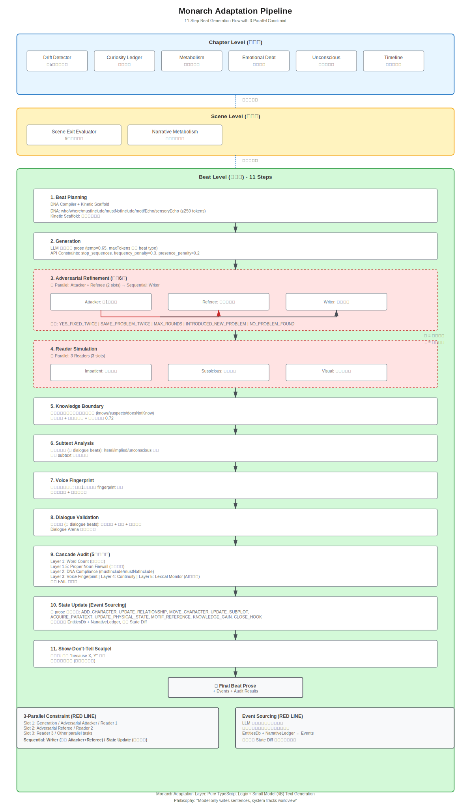

<p align="center">
  
</p>

<h1 align="center">Monarch</h1>

<p align="center">
  <a href="README.md">中文</a> | <a href="README.en.md">English</a> | <a href="README.ja.md">日本語</a>
</p>

***

> [!IMPORTANT]
> 🚧 **Project Under Active Development** - This README may not reflect the current codebase. Please refer to the code and `CLAUDE.md` for accurate information.

> [!WARNING]
> ⚠️ Monarch is currently an early test/development version. Some features may be unstable.

## Overview

**Monarch** is a small-model writing Agent built on [InkOS](https://github.com/Narcooo/inkos), focused on handling complex narrative logic with small models (4B parameters).

> [!NOTE]
> Monarch shares the same environment configuration with InkOS and requires no separate setup.
>
> For complete features, commands, and usage, please refer to the [InkOS official repository](https://github.com/Narcooo/inkos).

### Core Philosophy

**The model only writes sentences; the system tracks worldbuilding.**

4B-parameter small models cannot handle complex logical reasoning and creative writing simultaneously. Monarch's approach:

- **Pure TypeScript handles all logic**: Motif tracking, emotional arcs, beat planning, consistency auditing, character knowledge tracking
- **LLM only generates text**: Outputs specification-compliant prose under strict API constraints

## Usage

### Two Execution Modes

```bash
# Adaptation Mode (default) - Small model with adaptation layer
monarch write next <book-id>

# Full Model Mode - Direct InkOS multi-Agent pipeline
monarch write next <book-id> --no-adaptation
```

| Mode | Description | Use Case |
|------|-------------|----------|
| **Adaptation** | Small model + TypeScript logic | Save tokens, long-term creation |
| **Full Model** | Complete InkOS pipeline | Stronger generation capability |

## Architecture Overview



### Adaptation Pipeline Three-Layer Architecture

```
Chapter Level
  ├─ Hook Prioritizer (intelligent plot thread priority, supports long-term hooks)
  ├─ Drift Detector (detect drift every 5 chapters)
  ├─ Curiosity Ledger (track reader questions)
  ├─ Chapter Health Monitor (real-time quality monitoring)
  ├─ Emotional Debt Analysis (emotional debts)
  ├─ Unconscious Analysis (unconscious content)
  └─ Timeline Analysis (timeline conflicts)

Scene Level
  ├─ Scene Exit Evaluator (9 exit conditions)
  └─ Narrative Metabolism (real-time monitoring)

Beat Level - 11-Step Process
  1. Beat Planning (DNA compression ≤250 tokens + Beat type recommendation)
  2. Generation (LLM generation)
  3. Adversarial Refinement (max 6 rounds)
  4. Reader Simulation (three readers)
  5. Knowledge Boundary (knowledge check + character knowledge tracking)
  6. Subtext Analysis (subtext detection)
  7. Voice Fingerprint (voice consistency)
  8. Dialogue Validation (dialogue validation)
  9. Cascade Audit (5-layer quality gate)
  10. State Update (event sourcing)
  11. Show-Don't-Tell Scalpel (post-processing)
```

### Intelligent Systems (New)

**1. Hook Prioritizer**
- Automatically adjusts hook priorities to prevent plot threads from being forgotten
- Supports long-term hooks (main plot threads spanning 50+ chapters)
- Auto-adjusts based on chapter progress, hook age, and staleness

**2. Beat Type Recommender**
- Intelligently recommends next beat type to avoid monotonous rhythm
- Based on 6 rules: avoid consecutive same types, balance dialogue/action ratio, tension level, hook requirements, chapter progress, break patterns

**3. Chapter Health Monitor**
- Real-time monitoring of chapter generation quality (6 metrics)
- Dialogue ratio, action ratio, tension variance, word distribution, rhythm monotony, progress estimation

**4. Style Consistency Checker**
- Checks if new chapters match established writing style
- Analyzes sentence length, lexical diversity, punctuation usage

**5. Dynamic Motif Extractor**
- Automatically extracts story-specific motifs from story_bible and chapter content
- Replaces hardcoded generic motif vocabulary, adapts to each story's unique imagery

**6. Knowledge Tracker** ⭐ New
- **Solves core problem**: Prevents AI from making characters say things they shouldn't know
- Tracks each character's knowledge state (knows/suspects/doesNotKnow)
- Automatically validates knowledge boundaries after each beat generation
- Auto-extracts new knowledge and updates tracking state
- See: `packages/core/src/adaptation/character/KNOWLEDGE_TRACKING.md`

### Key Features

**DNA Compression**: Compress full story state into ≤250 tokens
- `who` / `where` / `mustInclude` / `mustNotInclude` / `motifEcho` / `sensoryEcho`

**Speculative Generation**: 3 semantic variants × 3 syntactic strategies in parallel

**Cascade Audit**: 5-layer quality validation (word count / proper nouns / DNA compliance / voice / continuity)

**Event Sourcing**: LLM never directly modifies state, all changes through event application

**Parallel Constraint**: Max 4 concurrent LLM calls

## Relationship with InkOS

| Feature | InkOS | Monarch |
|---------|-------|---------|
| Positioning | General long-form novel writing Agent | Small model writing Agent |
| Architecture | Multi-Agent collaboration | Adaptation Layer + InkOS Pipeline |
| LLM Usage | Handle logic and writing | Only generate text, logic by TypeScript |
| Intelligent Systems | Basic | 6 enhancement systems (Hook/Beat/Health/Style/Motif/Knowledge) |

Monarch uses the same environment configuration as InkOS, no additional setup required. Please refer to [InkOS Configuration Guide](https://github.com/Narcooo/inkos#configuration).

## Documentation

- `CLAUDE.md` - Project architecture and development guide (most accurate)
- `packages/core/src/adaptation/character/KNOWLEDGE_TRACKING.md` - Character knowledge tracking system guide
- `packages/core/src/adaptation/narrative/LONG_TERM_HOOKS.md` - Long-term hook usage guide

## License

[AGPL-3.0](LICENSE)
