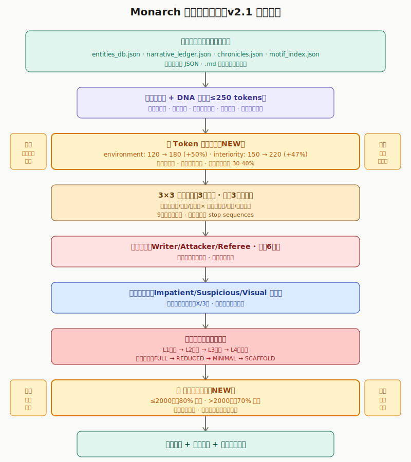

<p align="center">
  
</p>

<h1 align="center">Monarch</h1>

<p align="center">
  <a href="README.md">中文</a> | <a href="README.en.md">English</a> | <a href="README.ja.md">日本語</a>
</p>

***

## 概述

**Monarch** 是基于 [InkOS](https://github.com/Narcooo/inkos) 构建的小模型写作 Agent，专注于使用小模型（4B参数）处理复杂叙事逻辑。

> [!WARNING]
> ⚠️ Monarch 目前是早期测试开发版本，部分功能尚未稳定完善。

> [!NOTE]
> Monarch 与 InkOS 共用同一套环境配置，无需单独配置。
>
> 有关完整功能、命令和使用方式，请参考 [InkOS 官方仓库](https://github.com/Narcooo/inkos)。

### 核心哲学

**模型只负责写句子，系统负责追踪世界观。**

4B 参数的小模型无法同时处理复杂逻辑推理和创造性写作。Monarch 的做法是：

- **纯 TypeScript 处理所有逻辑**：母题追踪、情感弧线、节拍规划、一致性审计
- **LLM 只负责生成文本**：在严格的 API 约束下输出符合规范的 prose

## 架构概览

<p align="center">
  
</p>

### 最新优化（v2.1）

- **Token 预算优化**: environment +50%, interiority +47%，减少空响应和重试
- **动态字数阈值**: 基于目标字数的递减比例（≤2000字用80%，>2000字用70%）
- **实时进度显示**: 显示对抗精炼轮数和读者模拟通过数

<details>
<summary>查看完整架构图</summary>
<p align="center">
  
</p>
</details>

### Adaptation Pipeline 三层架构

```
┌─────────────────────────────────────────────────────────────────┐
│  Chapter Level (章节级别)                                        │
│  ├── Narrative Drift Detector    # 每5章检测叙事漂移            │
│  ├── Curiosity Ledger            # 好奇心问题追踪                │
│  └── Metabolism Reporter         # 章节健康度报告                │
├─────────────────────────────────────────────────────────────────┤
│  Scene Level (场景级别)                                          │
│  ├── Scene Exit Evaluator        # 9种场景退出条件               │
│  └── Narrative Metabolism        # 叙事代谢监控                  │
├─────────────────────────────────────────────────────────────────┤
│  Beat Level (节拍级别) - 8步流程                                 │
│  ├── 1. Beat Planning            # DNA Compiler + Kinetic       │
│  ├── 2. Generation               # LLM生成                       │
│  ├── 3. Adversarial Refinement   # Writer/Attacker/Referee      │
│  ├── 4. Reader Simulation        # 三读者模拟                    │
│  ├── 5. Knowledge Boundary       # 角色知识边界检查              │
│  ├── 6. Cascade Audit            # 5层级联审计                   │
│  ├── 7. State Update             # Event Sourcing               │
│  └── 8. Show-Don't-Tell Scalpel  # 后处理                        │
└─────────────────────────────────────────────────────────────────┘
```

## 使用方式

### 两种执行模式

```bash
# Adaptation 模式（默认）- 使用小模型适配层
monarch write next <book-id>

# 完整模型模式 - 直接使用 InkOS 多 Agent 管线
monarch write next <book-id> --no-adaptation
```

| 模式 | 说明 | 适用场景 |
|------|------|---------|
| **Adaptation** | 小模型 + TypeScript逻辑 | 节省token，适合长期创作 |
| **完整模型** | 完整InkOS管线 | 需要更强生成能力 |

### 核心工作流

```
用户输入
    ↓
准备章节输入 (IntentCompiler 编译 story 文件)
    ↓
初始化 AdaptationHooks (EventSourcer + LexicalMonitor)
    ↓
ChapterPipelineAdapter.generateChapter()
    ├── planBeats() → 节拍规划
    └── generateBeat() → 逐节拍生成
        ├── DNA 压缩 (250 token 预算)
        ├── 3路并发生成 (terse/internal/sensory)
        ├── 审计 + 选择最优候选
        └── 事件提取 + 状态更新
    ↓
完整 InkOS 管线
    ├── 审计 + 修订
    ├── 生成真相文件 (ChapterAnalyzerAgent)
    ├── 真相文件验证
    └── 落盘 + 快照 + 通知
```

## 关键特性

### 1. DNA 压缩
将完整故事状态压缩成 ≤250 tokens 的 NarrativeDNA：
- `who` - 当前场景角色
- `where` - 地点描述
- `mustInclude` / `mustNotInclude` - 必须/禁止元素
- `motifEcho` - 母题回响
- `sensoryEcho` - 感官闪回

### 2. 推测生成
并行生成 3 个语义变体，每个变体 3 种句法策略：
- **Variant A**: terse (简洁, temp 0.7)
- **Variant B**: internal (内心, temp 0.8)
- **Variant C**: sensory (感官, temp 0.75)

### 3. 级联审计
5层质量验证：
1. 规则审计 - HardBan 检查
2. 专有名词审计 - 拼写一致性
3. 结构审计 - 字数和节拍类型
4. 声音审计 - AI 痕迹词
5. 连续性审计 - 情节连贯性

### 4. 事件溯源
LLM 从不直接修改状态文件，所有状态变更通过事件提取和应用：
- `ADD_CHARACTER`, `UPDATE_RELATIONSHIP`, `MOVE_CHARACTER`
- `UPDATE_SUBPLOT`, `ACQUIRE_PARTICLE`, `KNOWLEDGE_GAIN`
- 生成状态差异，可追溯每章变更

## 故事文件支持

Adaptation 层读取并处理 10+ 种故事文件：
- `story_bible.md` - 故事设定
- `style_guide.md` - 风格指南
- `volume_outline.md` - 卷大纲
- `chapter_summaries.md` - 章节摘要
- `subplot_board.md` - 副线板
- `emotional_arcs.md` - 情感弧线
- `character_matrix.md` - 角色矩阵
- `parent_canon.md` / `fanfic_canon.md` - 原作设定

## RED LINES（架构约束）

- **NO LLM FOR LOGIC** - 所有逻辑必须是纯 TypeScript
- **MAX 3 PARALLEL CALLS** - Promise.all 的 LLM 调用不超过 3 个
- **EVENT SOURCING ONLY** - LLM 绝不直接修改状态文件
- **NO MODIFICATION OF BASE INKOS** - 所有代码在 `src/adaptation/` 目录下

## 目录结构

```
packages/core/src/adaptation/
├── pipeline/          # 主编排器
├── state/             # 事件溯源、意图编译、母题索引
├── beat/              # 节拍规划、推测生成
├── context/           # DNA 压缩
├── audit/             # 级联审计
├── generation/        # 对抗精炼循环
├── simulation/        # 三读者模拟器
├── character/         # 知识边界检查
├── narrative/         # 漂移检测、好奇心账本、代谢
├── scene/             # 场景退出条件
├── llm/               # API 约束
└── integration/       # 钩子、编排器、管线适配
```

## 与 InkOS 的关系

| 特性 | InkOS | Monarch |
|------|-------|---------|
| 定位 | 通用长篇小说写作 Agent | 小模型写作 Agent |
| 架构 | 多 Agent 协作 | Adaptation Layer + InkOS Pipeline |
| LLM 使用 | 处理逻辑和写作 | 仅生成文本，逻辑由 TypeScript 处理 |

### 环境配置

Monarch 与 InkOS 使用相同的环境配置方式，无需额外配置。请参考 [InkOS 配置指南](https://github.com/Narcooo/inkos#配置)。

## 许可证

[AGPL-3.0](LICENSE)
